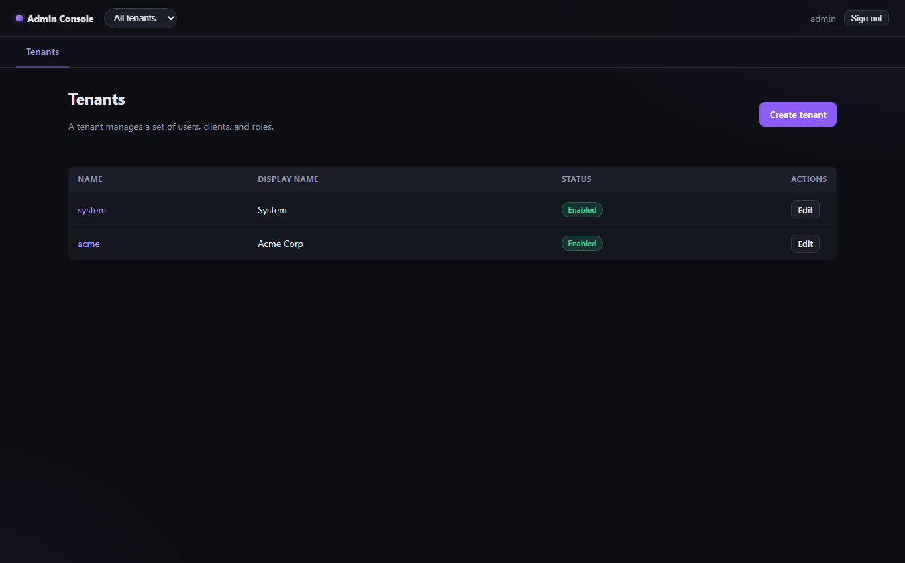
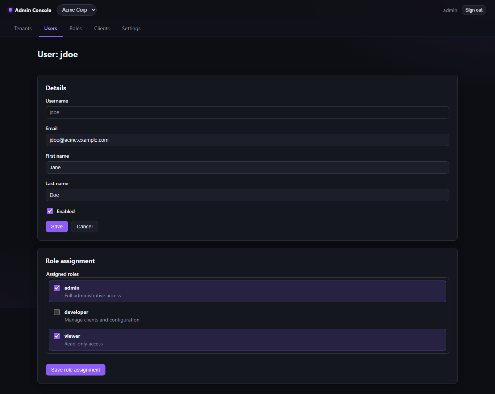
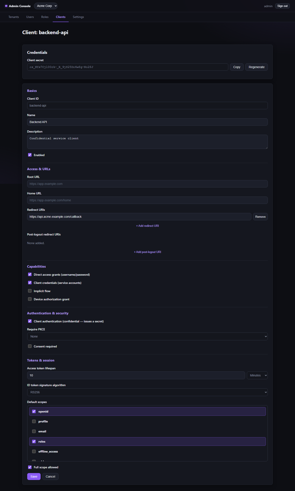
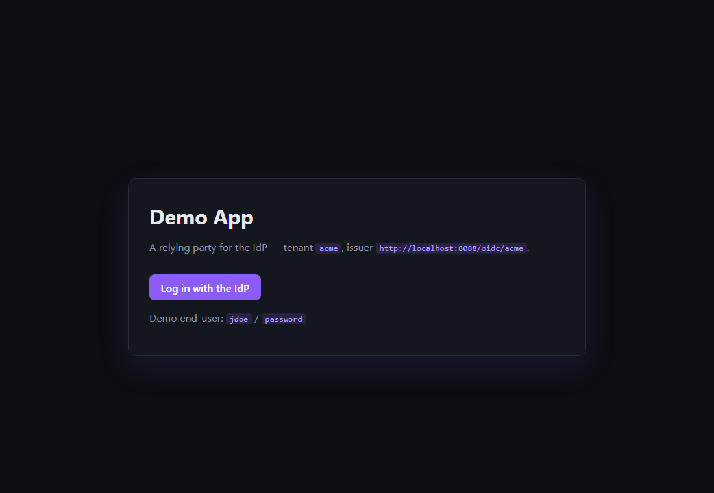
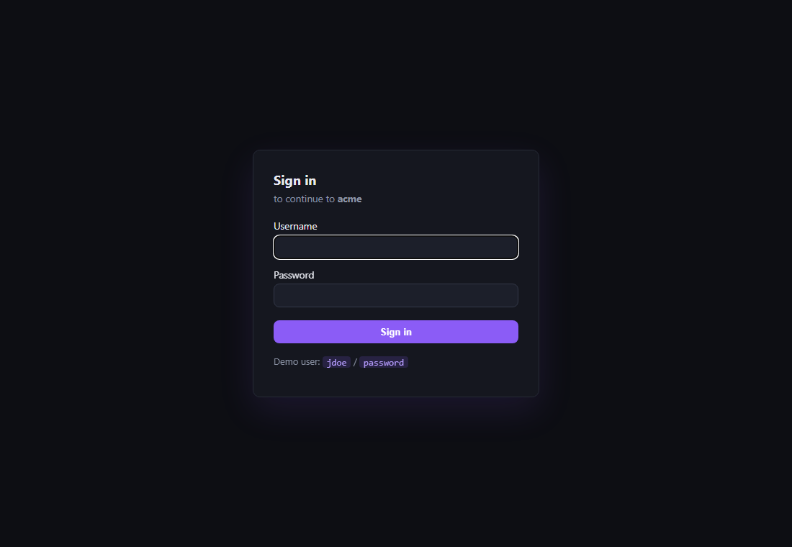
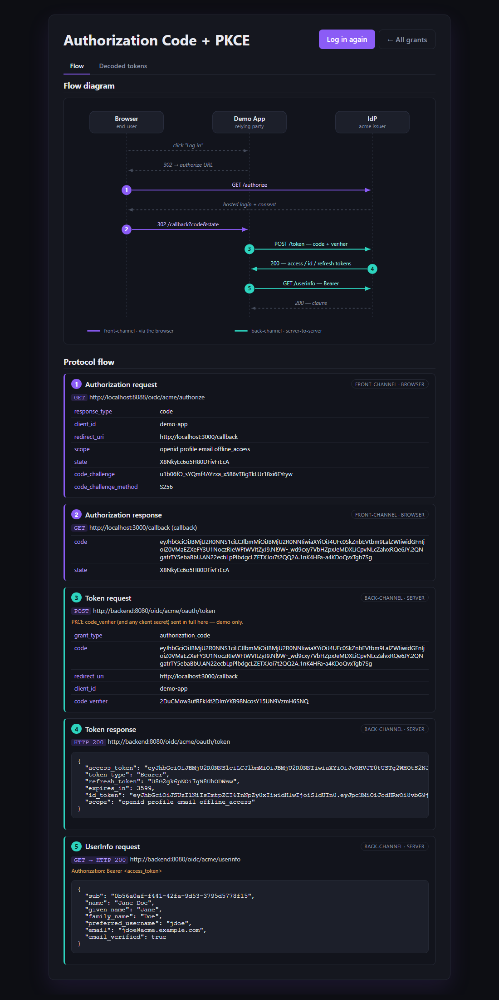
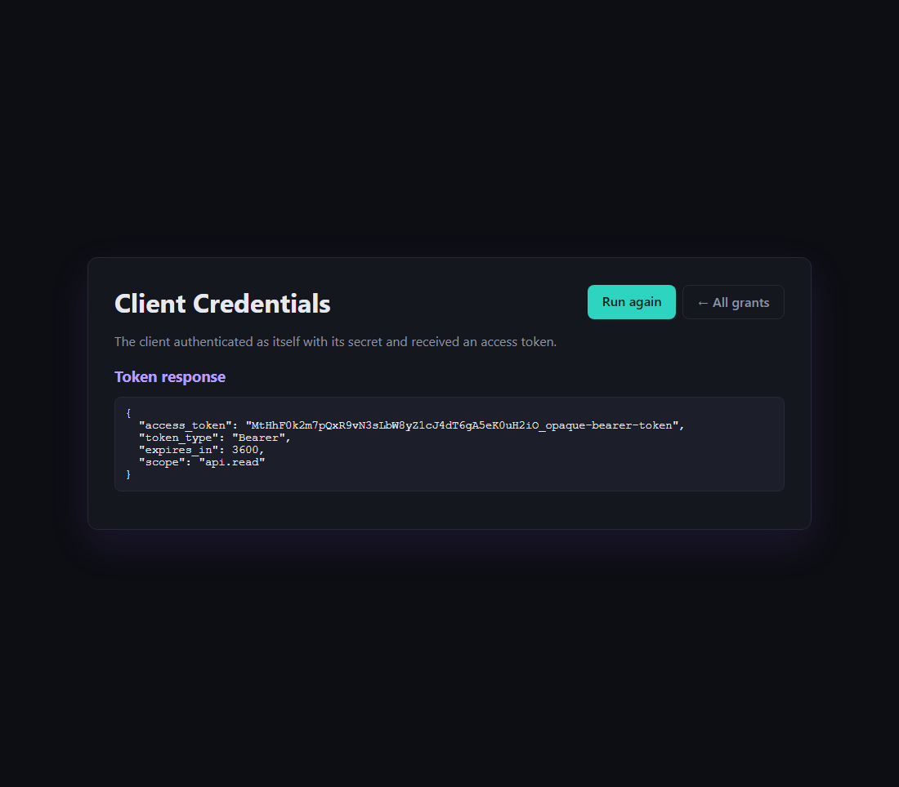

# IdP — Identity Provider Platform

A multi-tenant identity provider with a web admin console. Monorepo:

```
idp/
├── backend/             Go API (modular monolith) + OIDC provider, on Postgres
├── admin-console/       React + TypeScript admin SPA
├── client/              demo OIDC relying-party app (test the end-user login)
└── docker-compose.yml   run the whole stack with one command
```

## What it is

- **Admin console** (`admin-console/`) — a React app to manage **tenants**, and within each tenant
  its **users**, **clients**, and **roles** (list / create / edit), including assigning roles to a
  user. Dark theme; signs in with an httpOnly session cookie.
- **Backend** (`backend/`) — a Go modular monolith (clean-architecture layers: domain → service →
  repository port → sqlc adapter; cross-module deps wired as interfaces at one composition root):
  - **Management API** for the console (auth, tenants, users, roles, clients) on Postgres.
  - **OIDC provider** (built on `zitadel/oidc`) with a **per-tenant issuer** (`/oidc/{tenant}`):
    discovery + JWKS, `/authorize` → hosted login (PKCE), `/token` (code + refresh), `/userinfo`.

Two distinct auth contexts: the **console** logs admins in via a session cookie (BFF); the **OIDC
provider** issues tokens to _client apps_ for _their_ end-users.

## Screenshots

**Admin console** — tenants, and a user's role assignment:

|                   Tenants                   |                    Role assignment                     |
| :-----------------------------------------: | :----------------------------------------------------: |
|  |  |

OIDC client settings (redirect URIs, grant types, PKCE, token lifetimes, secret):



**Demo relying party** — pick a grant to run, then inspect every message exchanged with the IdP:
a sequence diagram plus a request/response timeline. Two grants are wired — **authorization code +
PKCE** (an end-user logs in via the IdP's hosted login) and **client credentials** (the app
authenticates as itself, no user):

|            Demo app — pick a grant            |          IdP hosted login (auth-code)           |
| :-------------------------------------------: | :---------------------------------------------: |
|  |  |

|     Authorization code + PKCE — flow + every message     |              Client credentials — back-channel only               |
| :------------------------------------------------------: | :---------------------------------------------------------------: |
|  |  |

## Run everything with Docker (easiest)

Just **Docker Desktop** required. From this folder:

```bash
docker compose up --build
```

Then open:

- **http://localhost:5173** — admin console (sign in **`admin` / `admin`**)
- **http://localhost:3000** — demo app; click _Log in with the IdP_ and sign in as the end-user
  **`jdoe` / `password`**
- **http://localhost:8080** — the IdP API / OIDC issuer (`/oidc/{tenant}`)

The backend applies migrations and seeds demo data (`system`/`acme` tenants, users, roles,
clients) on startup. Port already taken? Override e.g. `BACKEND_PORT=8088 WEB_PORT=5174 docker
compose up`. Stop with `Ctrl-C`; `docker compose down -v` also wipes the database.

## Or run it locally (without Docker)

Prereqs: **Docker Desktop** (just for Postgres), **Go 1.26+**, **Node 20+**.

**Terminal 1 — backend (from `backend/`):** the binary self-migrates, so no goose step.

```bash
docker compose up -d db        # Postgres only
go run ./cmd/api               # http://localhost:8080  (migrates + seeds, then serves)
```

**Terminal 2 — console (from `admin-console/`):**

```bash
npm install
npm run dev          # http://localhost:5173
```

**Terminal 3 — demo client (from `client/`):**

```bash
node server.mjs      # http://localhost:3000
```

Sign in to the console with **`admin` / `admin`**; log an end-user into the demo app with
**`jdoe` / `password`**.

## Tests

```bash
cd admin-console && npm run test     # Vitest + RTL (MSW-backed; no backend needed)
cd backend       && go test ./...    # Go service tests (no DB needed)
```

## Status & notes

The console talks only to the backend (Vite proxies `/api → :8080`; MSW is used only by the test
suite). Each package has its own `README.md` with details. Known follow-ups (documented in
`backend/README.md`): OIDC keys/tokens are in-memory (single-instance dev).
